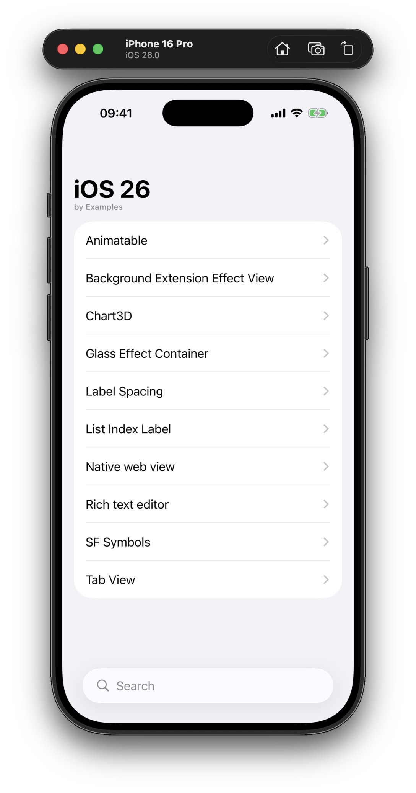

# iOS 26 by Examples

A collection of hands-on examples demonstrating new features and APIs introduced in iOS 26, built with SwiftUI. Each example is self-contained and showcases a specific capability or UI enhancement available in the latest iOS release.

## Examples

- **AnimatableView**: Demonstrates custom animatable shapes and interactive animation using SwiftUI's new `@Animatable` macro.
- **BackgroundExtensionEffectView**: Shows how to use the new `.backgroundExtensionEffect()` modifier for immersive backgrounds.
- **Chart3DView**: Explores the new 3D charting capabilities with `Chart3D` and `SurfacePlot`.
- **GlassEffectContainerView**: Showcases advanced glassmorphism effects and container unions using `GlassEffectContainer` and related APIs.
- **LabelSpacingView**: Demonstrates new label spacing and icon width customization with `.labelIconToTitleSpacing` and `.labelReservedIconWidth`.
- **ListSectionIndexLabel**: Uses `.sectionIndexLabel` and `.listSectionIndexVisibility` for improved list navigation.
- **NativeWebView**: Integrates a native `WebView` with SwiftUI, loading a web page on appear.
- **NewTabView**: Presents the enhanced `TabView` with new tab roles, bottom accessories, and minimize behavior.
- **RichTextEditor**: Utilizes the improved `TextEditor` for rich text editing with attributed strings.
- **SFSymbolsView**: Animates and customizes SF Symbols with new symbol effects and variable values.

## Author

Artem Novichkov, https://www.artemnovichkov.com/

## License

The project is available under the MIT license. See the [LICENSE](./LICENSE) file for more info.